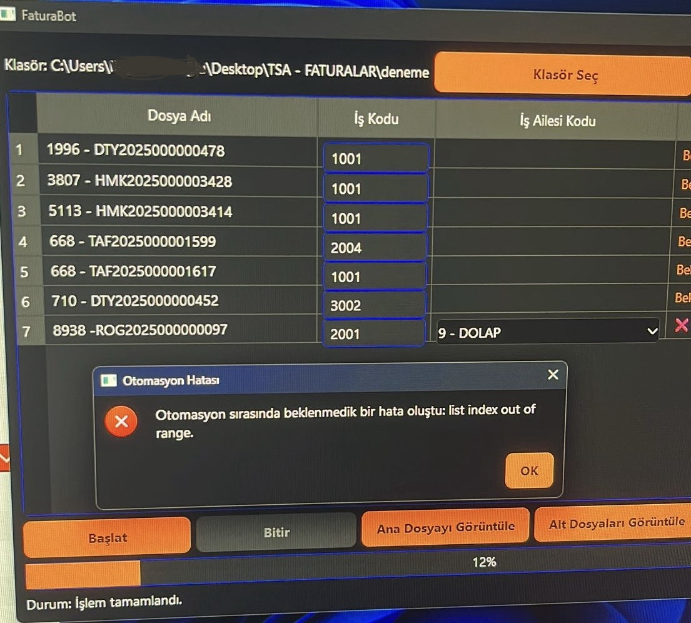
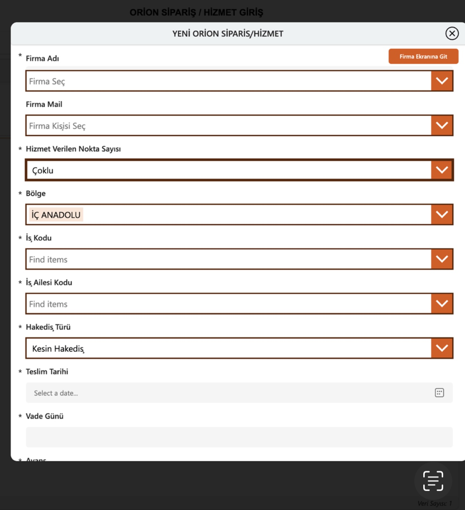

# Enterprise Invoice Automation System


<p align="center">
  
</p>

...

## Screenshots

### Microsoft Power Apps Automation

<p align="center">
  
</p>

> A Windows desktop automation application developed to streamline invoice processing workflows for enterprise departments using Microsoft Power Apps.

> **Note:** This repository is intended for portfolio purposes only. The source code is private due to commercial confidentiality.

---

## Overview

This project is a desktop automation solution developed to eliminate repetitive manual tasks during invoice processing.

Although both target departments follow similar business processes, each department has its own workflow rules, validation logic, and operational requirements. Separate desktop applications were developed on a shared architecture to accommodate these differences while maximizing code reuse.

The application automates invoice registration by interacting directly with Microsoft Power Apps, reducing manual effort, minimizing human error, and significantly improving processing speed.

---

## Features

* Automated invoice registration
* Microsoft Power Apps desktop automation
* Intelligent invoice type detection
* Automatic company identification
* Dynamic business rule execution
* Store validation
* Existing / New / Closed store handling
* PDF and Excel document processing
* Automatic file upload
* Automatic processed-file organization
* Batch processing support
* Progress tracking
* Error detection and recovery
* User-friendly desktop interface
* Manual intervention support for exceptional cases

---

## Technologies

* Python
* PySide6 (Qt)
* PyAutoGUI
* PyWinAuto
* Win32 COM
* Power Apps Desktop
* Multithreading
* Windows Automation API

---

## Architecture

```
Invoice Folder
        │
        ▼
Desktop Application
        │
        ▼
Invoice Analysis
        │
        ▼
Business Rule Engine
        │
        ▼
Power Apps Automation
        │
        ▼
Validation
        │
        ▼
Document Upload
        │
        ▼
Processed Archive
```

---

## Workflow

1. Select the invoice folder.
2. Load supported invoice files.
3. Enter the required business code.
4. Connect to Microsoft Power Apps.
5. Automatically identify invoice information.
6. Execute department-specific business rules.
7. Upload invoice documents.
8. Save the transaction.
9. Move processed files into the archive folder.

---

## Key Capabilities

* Handles multiple company-specific workflows.
* Supports different invoice structures.
* Dynamic store matching.
* Automated business code selection.
* Automatic document management.
* Multi-file processing.
* Robust exception handling.
* Responsive desktop UI.
* Thread-safe background processing.

---

## Project Highlights

* Reduced repetitive manual data entry.
* Improved processing consistency.
* Minimized user errors.
* Increased operational efficiency.
* Designed for enterprise-scale daily usage.

---

## Repository Contents

This repository intentionally excludes:

* Source code
* Internal business rules
* Company-specific configurations
* Authentication information
* Confidential datasets

The repository is intended solely to showcase the project's architecture, functionality, and technical scope.

---

## Future Improvements

* OCR integration
* Barcode and QR recognition
* AI-assisted invoice validation
* Automatic reporting dashboard
* ERP integration
* Cloud synchronization
* Activity logging
* Configuration management

---

## License

This project is proprietary.

The implementation and source code are not publicly available due to commercial confidentiality agreements.

Only documentation is shared for portfolio purposes.
